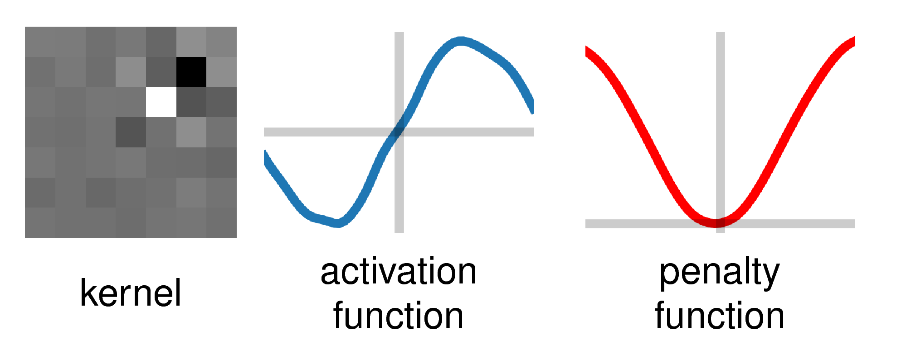

# Variational Network for Image Denoising

This repository provides a tensorflow implementation of [*Trainable Nonlinear Reaction Diffusion (TNRD) model*](https://arxiv.org/abs/1503.05768) [1] and was used in our publication [*Variational Networks: Connecting Variational Methods and Deep Learning*](https://link.springer.com/chapter/10.1007/978-3-319-66709-6_23), GCPR 2017. If you use this code, please refer to:

```
@inproceedings{kobler_gcpr2017,
  author = {Erich Kobler and Teresa Klatzer and Kerstin Hammernik and Thomas Pock},
  title = {{Variational Networks: Connecting Variational Methods and Deep Learning}},
  booktitle = {2017 German Conference on Pattern Recognition (GCPR)},
  year = {2017},
}
```
## Requirements
This framework requires Python 3 and the [tensorflow-icg](https://github.com/VLOGroup/tensorflow-icg) repository, which is forked from [Tensorflow]() and additionally provides custom operators, functions and classes to build and train the variational network (VN). Please follow the instructions there to correctly install `tensorflow-icg`.

## Data
To download the used training and test data simply execute
```
python get_training_data.py
```
For training, the 200 train and test images from the [BSDS500 dataset](https://www2.eecs.berkeley.edu/Research/Projects/CS/vision/bsds/) are used, resulting in a total of 400 images.
For testing, we use the same 68 images as in the [Field of Experts model](http://www.visinf.tu-darmstadt.de/vi_research/code/foe.en.jsp).

Parameters used for training such as noise level, batch size and patch size,
can be configured in the file `configs/data.yaml`.

## Trainable parameters
For details on the algorithm we refer to [1,2]. We train individual filter kernels, activation functions and dataterm weights for each of the *Ns* stages.
- Filter kernels: arbitrary *Nk* filter kernels with zero-mean and L2 norm <= 1.
- Activation functions: Weighted combination of *Nw* Gaussian radial basis functions (RBFs), defined in the range *[vmin, vmax]*.
- Dataterm weights >= 0

All these parameters can be configured in the file `configs/denoising_vn.yaml`, which also provides the possibility to configure the initialization for the dataterm weights and activation functions. It is also possible to skip the dataterm weights during learning.

## Training
For training, we use the iPALM optimizer [3] which allows us to handle the additional constraints on the parameters easily. The number of training iterations
can be set in the file `configs/training.yaml`. Additionally, you can define
the location of the log directory there. In some cases, you have to set the correct GPU in `CUDA_VISIBLE_DEVICES`.

```
python train_denoising_vn.py
```
You can oberserve the progress of the training in Tensorboard using the specified log directory.

## Evaluation
To evaluate all experiments in your log directory you can execute
```
python evaluate_denoising_vn.py
```

## Testing
To test a trained model with the name `model_name` from the log directory on a specific image `image_name`, use the python script

```
python denoise_image.py image_name model_name
```

If you want to add Gaussian noise *before* the image is denoised add the flag `-s 25` for a noise level of 25.

## Plot parameters
To plot the parameters of a trained model with the name `model_name` from the log directory, use the python script

```
python plot_parameters.py model_name
```
A sample parameter set is visualized here:
<div><div align="center">

</div>

## Benchmark
We compared the performance of our current implementation of the VN with the TNRD model [1]. We were able to reduce the number of parameters while achieving the same
Peak-Signal-to-Noise (PSNR) ratio. The used configuration files are located in `configs/ref_5s_5x5_24Nk` and `configs/ref_5s_7x7_48Nk`. The pretrained VN network models are located in `logs/vndenoise/`.

| Model                                    | Parameters    | PSNR          |
|:----------------------------------------:|--------------:|--------------:|
| TNRD Ns=5 5x5 Nk=24 Nw=63                  | 10,565        | 28.78         |
| VN Ns=5 5x5 Nk=24 Nw=31                    | 6,720         | 28.78         |
| TNRD Ns=5 7x7 Nk=48 Nw=63                  | 26,885        | 28.92         |
| VN Ns=5 7x7 Nk=48 Nw=31                    | 19,200        | 28.92         |

## References
1.  Y Chen, W Yu, T Pock. [*On learning optimized reaction diffusion processes for effective image restoration*](https://arxiv.org/abs/1503.05768). Proceedings of the IEEE Conference on Computer Vision and Pattern Recognition, pp. 5261-5269, 2015.

2. E Kobler, T Klatzer, K Hammernik, T Pock. [*Variational Networks: Connecting Variational Methods and Deep Learning*](https://link.springer.com/chapter/10.1007/978-3-319-66709-6_23). German Conference on Pattern Recognition, pp. 281-293, 2017.

3. T Pock and S Sabach. [*Inertial Proximal Alternating Linearized Minimization (iPALM) for Nonconvex and Nonsmooth Problems*](https://arxiv.org/abs/1702.02505). SIAM Journal on Imaging Science, 9(4), pp. 1756–1787, 2016.
